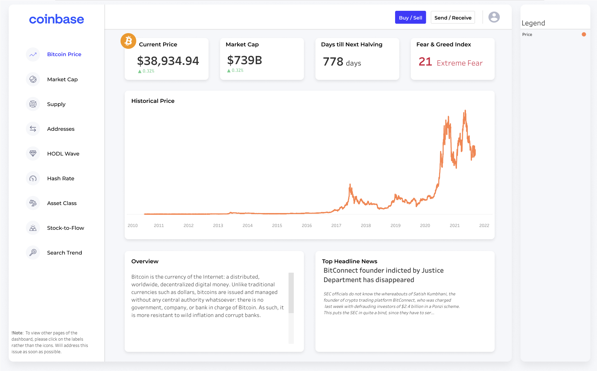
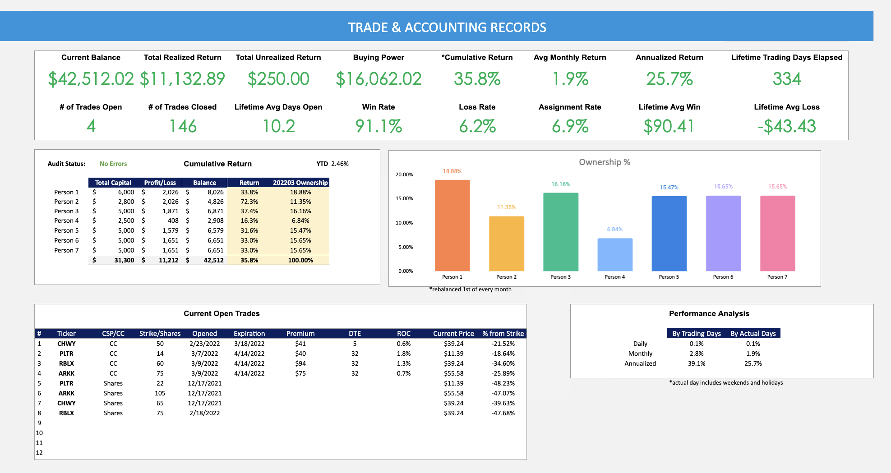
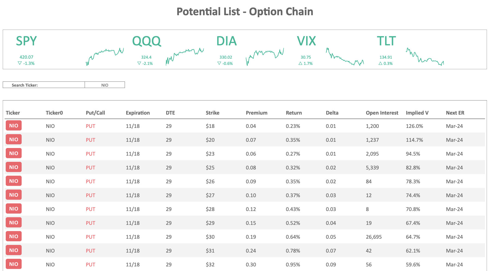

# Kevin Chiu Portfolio

# [Sample SQL Script Here](code/sample_sql.sql)

# [Bitcoin Dashboard (Inspired by Coinbase UI)](https://tabsoft.co/3HJIoBg)
* Developed an automated dashboard on Tableau Public that tracks on-chain metrics for Bitcoin: including circulating supply, total supply on exchanges, inflation rate, hash rate, stock-to-flow, google search trends, etc.
* The goal of this dashboard is to demystify Bitcoin for friends who believe Bitcoin does not have intrinsic value.
* Dashboard refreshes daily automatically with data extracted from Glassnode API automated using Google App Script.
* Designed dashboard in Figma.

[Google App Script code here](code/bitcoin_dashboard_google_script)

# Trading Dashboard
* Developed a trading dashboard tracing key performance metrics in Google Sheets for an investment club that I co-founded: including total realized return, total unrealized return, win rate, loss rate, assignment rate, etc.
* All trading data are extracted via TD Ameritrade API and refreshed automatically daily using Google App Script.
* Built automation in Google App Scipt to process and audit trades to ensure data accuracy for tax reporting purposes.

[Google App Script code here](code/trading_dashboard)

# Option Scanner
* Built a tool in Google Sheets that scans for potential option trades based upon certain criterias: including Delta, Theta, Date to Expiration, Return on Capital, Open Interest, Volume, etc.
* The tool also displays intraday trading prices for major indices such as S&P 500, NASDAQ, DOW JONES, etc.
* All market data are extracted via TD Ameritrade API and refreshed automatically every 5 minutes using Google App Script.

[Google App Script code here](code/option_scanner)

